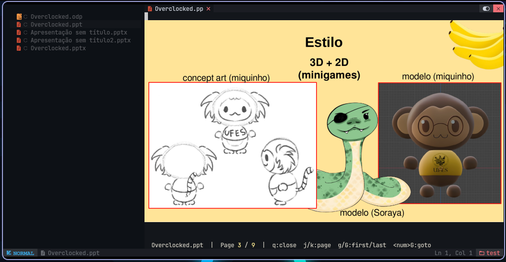

# buffer-preview.nvim

<p align="center">
  Give your Neovim buffers real previews instead of raw file bytes.
</p>

<p align="center">
  
  
</p>

<p align="center">
  <code>buffer-preview.nvim</code> hijacks the normal buffer read for supported
  files and replaces raw bytes with a read-only, navigable in-buffer preview.
  Keep the document inside Neovim, move with familiar Vim keys, and avoid
  context-switching to a separate viewer.
</p>

<a href="https://www.star-history.com/?repos=propilideno%2Fbuffer-preview.nvim&type=date&legend=top-left">
 <picture>
   <source media="(prefers-color-scheme: dark)" srcset="https://api.star-history.com/chart?repos=propilideno/buffer-preview.nvim&type=date&theme=dark&legend=top-left" />
   <source media="(prefers-color-scheme: light)" srcset="https://api.star-history.com/chart?repos=propilideno/buffer-preview.nvim&type=date&legend=top-left" />
   
 </picture>
</a>

## Requirements

Our baseline is support Neovim >= 0.10.

Everything else depends on which preview you want, install only what you need.

### Image preview

For PDF and presentation files (`.pdf`, `.pptx`, `.ppt`, `.odp`):

- [image.nvim](https://github.com/3rd/image.nvim): handles image rendering
- `ImageMagick`: required by image.nvim
- `pdftoppm`: required to convert pdf to png
- `pdfinfo`: required to show metadata (status line)
- `soffice`: for presentation conversion (.pptx, .ppt, .odp)

#### tmux support

For running image preview inside tmux, add to `~/.tmux.conf`:

```tmux
# https://github.com/3rd/image.nvim#tmux
set -gq allow-passthrough on
set -g visual-activity off
set -g focus-events on
```

### Data preview

- `sqlite3`: for SQLite files (.db, .sqlite, .sqlite3)

## Installation

With [lazy.nvim](https://github.com/folke/lazy.nvim):

```lua
{
  "propilideno/buffer-preview.nvim",
  event = {
    -- Image preview
    "BufReadCmd *.pdf", "BufReadCmd *.pptx", "BufReadCmd *.ppt", "BufReadCmd *.odp",
    -- Data preview
    "BufReadCmd *.db", "BufReadCmd *.sqlite", "BufReadCmd *.sqlite3",
  },
  dependencies = {
    "3rd/image.nvim", -- only needed for image preview (PDF / presentation)
  },
  opts = {},
}
```

#### Arch Linux

```sh
# Image preview
sudo pacman -S poppler imagemagick \
               libreoffice-fresh # Optional: for presentation preview

# Data preview
sudo pacman -S sqlite
```

#### Ubuntu / Debian

```sh
# Image preview
sudo apt install poppler-utils imagemagick \
                 libreoffice # Optional: for presentation preview

# Data preview
sudo apt install sqlite3
```

## Default Configuration

All fields are optional. These currently configure the PDF rendering backend.

```lua
require("buffer-preview").setup({
  -- "pdftoppm" (default) or "pdftocairo"
  rasterizer = "pdftoppm",
  -- Rasterization DPI (higher = sharper but slower)
  dpi = 200,
  -- Where rendered page PNGs are cached
  cache_dir = vim.fn.stdpath("cache") .. "/buffer-preview.nvim",
})
```

## Features

- [x] buffer-hijacking: supported buffers are hijacked and rendered as previews instead of raw bytes
- [x] page-viewer: read-only buffer with Vim-style page movement
- [x] PDF support (.pdf)
- [x] PowerPoint support (.pptx, .ppt)
- [x] OpenDocument Presentation support (.odp)
- [x] SQLite support (.db, .sqlite, .sqlite3)
- [ ] Parquet support
- [ ] Excel support

## Usage

### PDF / Presentation

| Key                                              | Action        |
| ------------------------------------------------ | ------------- |
| `j` `l` `↓` `]` `}` `Space` `Ctrl-d` `Ctrl-f`    | Next page     |
| `k` `h` `↑` `[` `{` `Ctrl-u` `Ctrl-b`            | Previous page |
| `g`                                              | First page    |
| `G`                                              | Last page     |
| `<number>G`                                      | Go to page N  |
| `r` `Ctrl-l`                                     | Refresh       |
| `q`                                              | Close viewer  |

### SQLite

Opening a `.db` / `.sqlite` / `.sqlite3` file spawns a two-buffer workspace:

- **Top** — read-only result preview. Initially shows the database schema
  (tables, views, indexes, triggers).
- **Bottom** — editable SQL buffer. Write any SQL that `sqlite3` accepts,
  including writes and DDL.

| Key / Command                | Action                                    |
| ---------------------------- | ----------------------------------------- |
| `<localleader>r`             | Run the whole bottom buffer as SQL        |
| `:BufferPreviewRunQuery`     | Same as above                             |

The bottom buffer's contents are preserved after a run. Successful write
statements render `Query executed successfully` in the top buffer; errors
render `-- Error` followed by the `sqlite3` stderr.

## How It Works

1. `BufReadCmd` hijacks supported files before Neovim reads their raw bytes.
2. The plugin replaces the file buffer with a read-only scratch buffer.
3. A format-specific backend generates preview data for that buffer.
4. The preview is rendered in-place while normal Neovim navigation remains in
   control.

For PDFs, the backend:

1. Detects page count with `pdfinfo`
2. Rasterizes pages to PNG with `pdftoppm` or `pdftocairo`
3. Displays the page with `image.nvim`
4. Uses page-navigation mappings instead of normal text editing

For presentation files (`.pptx`, `.ppt`, `.odp`), the backend:

1. Converts the presentation to PDF with `soffice --headless`
2. Reuses the same PDF page-count, rasterization, and display pipeline
3. Keeps the same in-buffer navigation and `Page` layout

For SQLite files (`.db`, `.sqlite`, `.sqlite3`), the backend:

1. Opens a two-buffer workspace: a read-only result buffer on top and an
   editable SQL buffer on the bottom
2. Runs an initial schema query against `sqlite_master` to orient the user
3. Pipes the bottom buffer's contents into the `sqlite3` CLI via stdin and
   renders the result (table / success message / error) into the top buffer

## Architecture

- `plugin/buffer-preview.lua`: dispatches buffer hijacking per backend
- `lua/buffer-preview/image/viewer.lua`: PDF / presentation preview buffer lifecycle
- `lua/buffer-preview/image/converter.lua`: converts presentation files to cached PDF with `soffice`
- `lua/buffer-preview/image/rasterizer.lua`: PDF page rasterization and cache
- `lua/buffer-preview/image/display.lua`: image rendering via `image.nvim`
- `lua/buffer-preview/data/runner.lua`: `sqlite3` CLI wrapper (data backends)
- `lua/buffer-preview/data/viewer.lua`: two-buffer data workspace
- `lua/buffer-preview/config.lua`: backend configuration
