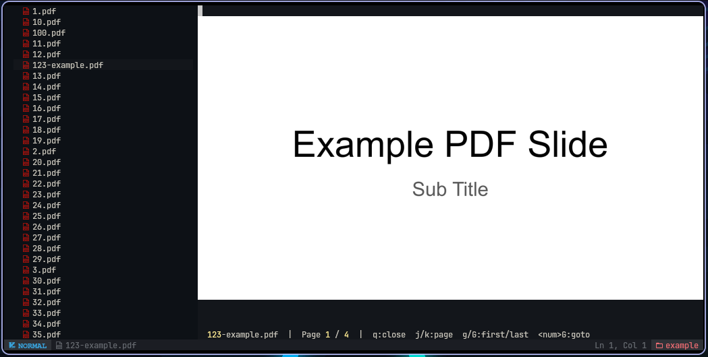

# buffer-preview.nvim

<p align="center">
  Give your Neovim buffers real previews instead of raw file bytes.
</p>

<p align="center">
  
</p>

<p align="center">
  <code>buffer-preview.nvim</code> hijacks the normal buffer read for supported
  files and replaces raw bytes with a read-only, navigable in-buffer preview.
  Keep the document inside Neovim, move with familiar Vim keys, and avoid
  context-switching to a separate viewer.
</p>

<a href="https://www.star-history.com/?repos=propilideno%2Fbuffer-preview.nvim&type=date&legend=top-left">
 <picture>
   <source media="(prefers-color-scheme: dark)" srcset="https://api.star-history.com/chart?repos=propilideno/buffer-preview.nvim&type=date&theme=dark&legend=top-left" />
   <source media="(prefers-color-scheme: light)" srcset="https://api.star-history.com/chart?repos=propilideno/buffer-preview.nvim&type=date&legend=top-left" />
   
 </picture>
</a>

## Requirements

- Neovim >= 0.10
- [image.nvim](https://github.com/3rd/image.nvim) (handles image rendering)
- ImageMagick (required by image.nvim)
- `pdftoppm` **or** `pdftocairo` (from `poppler` / `poppler-utils`)
- `pdfinfo` (from `poppler` / `poppler-utils`)
- `soffice` for presentation preview conversion (`.pptx`, `.ppt`, `.odp`)

## Installation

With [lazy.nvim](https://github.com/folke/lazy.nvim):

```lua
{
  "propilideno/buffer-preview.nvim",
  event = { "BufReadCmd *.pdf", "BufReadCmd *.pptx", "BufReadCmd *.ppt", "BufReadCmd *.odp" }, -- fires before Neovim reads the file, earlier than ft
  dependencies = { "3rd/image.nvim" },
  opts = {},
}
```

### Arch Linux

```sh
sudo pacman -S poppler imagemagick \
               libreoffice-fresh # Optional: for presentation preview
```

### Ubuntu / Debian

```sh
sudo apt install poppler-utils imagemagick \
                 libreoffice # Optional: for presentation preview
```


## Default Configuration

All fields are optional. These currently configure the PDF rendering backend.

```lua
require("buffer-preview").setup({
  -- "pdftoppm" (default) or "pdftocairo"
  rasterizer = "pdftoppm",
  -- Rasterization DPI (higher = sharper but slower)
  dpi = 200,
  -- Where rendered page PNGs are cached
  cache_dir = vim.fn.stdpath("cache") .. "/buffer-preview.nvim",
})
```

## Features

- [x] buffer-hijacking: supported buffers are hijacked and rendered as previews instead of raw bytes
- [x] page-viewer: read-only buffer with Vim-style page movement
- [x] PDF support (.pdf)
- [x] PowerPoint support (.pptx, .ppt)
- [x] OpenDocument Presentation support (.odp)
- [ ] Parquet support
- [ ] Excel support

## Navigation

| Key                                              | Action        |
| ------------------------------------------------ | ------------- |
| `j` `l` `↓` `]` `}` `Space` `Ctrl-d` `Ctrl-f`    | Next page     |
| `k` `h` `↑` `[` `{` `Ctrl-u` `Ctrl-b`            | Previous page |
| `g`                                              | First page    |
| `G`                                              | Last page     |
| `<number>G`                                      | Go to page N  |
| `r` `Ctrl-l`                                     | Refresh       |
| `q`                                              | Close viewer  |

## How It Works

1. `BufReadCmd` hijacks supported files before Neovim reads their raw bytes.
2. The plugin replaces the file buffer with a read-only scratch buffer.
3. A format-specific backend generates preview data for that buffer.
4. The preview is rendered in-place while normal Neovim navigation remains in
   control.

For PDFs, the backend:

1. Detects page count with `pdfinfo`
2. Rasterizes pages to PNG with `pdftoppm` or `pdftocairo`
3. Displays the page with `image.nvim`
4. Uses page-navigation mappings instead of normal text editing

For presentation files (`.pptx`, `.ppt`, `.odp`), the backend:

1. Converts the presentation to PDF with `soffice --headless`
2. Reuses the same PDF page-count, rasterization, and display pipeline
3. Keeps the same in-buffer navigation and `Page` layout

## Architecture

- `plugin/buffer-preview.lua`: registers buffer hijacking for supported formats
- `lua/buffer-preview/converter.lua`: converts presentation files to cached PDF with `soffice`
- `lua/buffer-preview/viewer.lua`: PDF preview buffer lifecycle
- `lua/buffer-preview/rasterizer.lua`: PDF page rasterization and cache
- `lua/buffer-preview/display.lua`: image rendering via `image.nvim`
- `lua/buffer-preview/config.lua`: backend configuration
